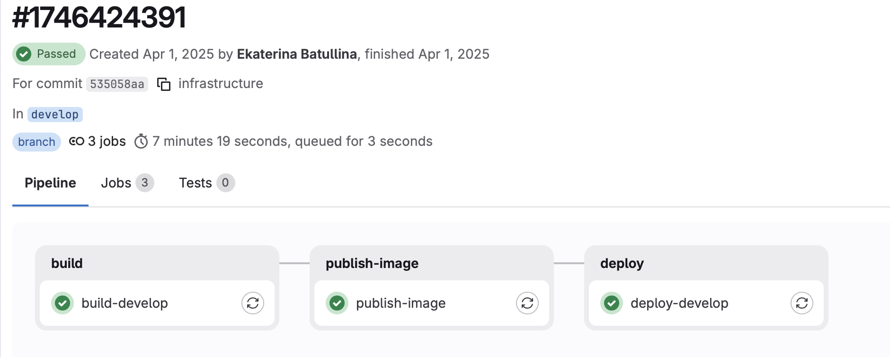
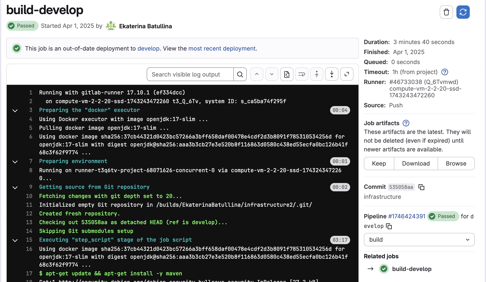
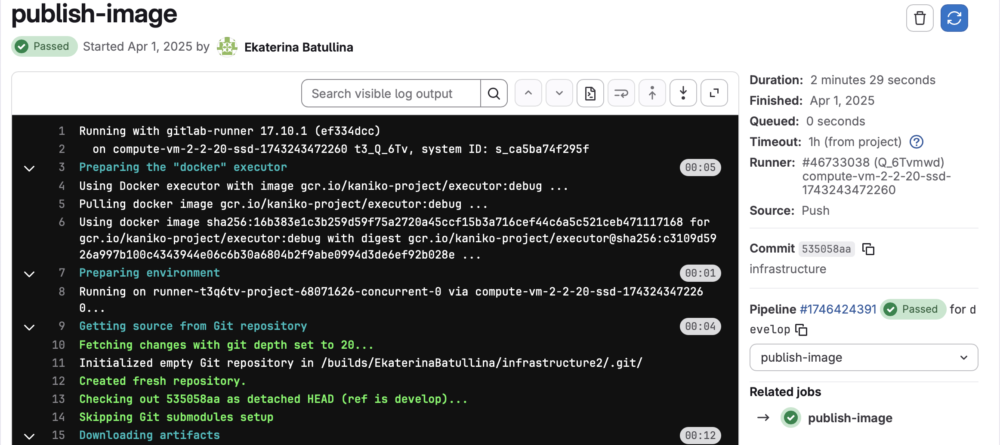
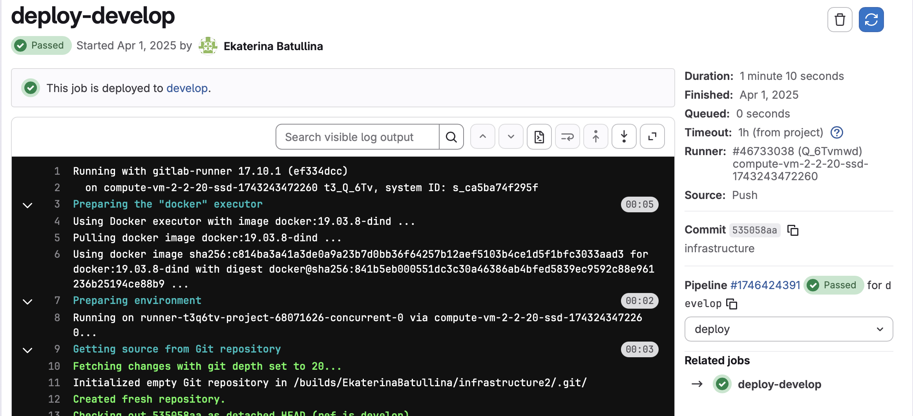

# Infrastructure & Deployment (LeetCode Clone) 

Репозиторий содержит конфигурацию инфраструктуры, CI/CD пайплайнов и сценарии развертывания микросервисной системы в облачной среде.

Проект разворачивался в Yandex Cloud в рамках гранта на облачную инфраструктуру.
В открытой версии репозитория в виду ограничений гранта сохранён только user-service, который использовался как демонстрационный экземпляр для настройки CI/CD, контейнеризации, деплоя и инфраструктурных сценариев. 

Основной интерес репозитория представляет не бизнес-логика конкретного сервиса, а инфраструктурный слой: Docker Compose, GitLab CI/CD, Kaniko, Nginx, автоматизация деплоя и организация окружений.

---

## CI/CD Pipeline Example

Ниже приведён пример успешного выполнения полного pipeline:

Pipeline реализует полный цикл доставки:

## **Build**
- Сборка микросервисов (Maven, OpenJDK 17)
- Кэширование зависимостей
- Сохранение артефактов

---

## **Publish**
- Сборка Docker-образов через Kaniko
- Push в GitLab Container Registry
- Использование layer caching для ускорения сборки

---

## **Deploy**
- Автоматизированный деплой на удалённые серверы
- Обновление контейнеров через docker-compose
- Разделение окружений:
  - develop - тестовая среда
  - main - production

---

# Решения

- Спроектирован полный CI/CD pipeline: от сборки до автоматического деплоя
- Реализована daemonless сборка Docker-образов через Kaniko, что повышает безопасность и упрощает интеграцию в CI
- Настроено разделение окружений (develop / production) с независимыми сценариями деплоя
- Организована централизованная маршрутизация через Nginx как API Gateway
- Автоматизирован деплой через SSH-скрипты с обновлением контейнеров без простоя

---

# Основные компоненты

-  **gitlab-ci.yml** - описание pipeline
-  **nginx.conf** - Reverse Proxy, SSL termination, базовый API Gateway
-  **docker-compose.main.yml** - оркестрация сервисов
-  **deploy.sh** - автоматизация деплоя

---

# Стек технологий
-  **Окружение:** Docker, Docker Compose (multi-stage builds)
-  **CI/CD:** GitLab CI/CD
-  **Web Server:** Nginx (Reverse Proxy, Load Balancing)
-  **Cloud:** Опыт развертывания в Yandex Cloud (Compute Cloud, VPC)
